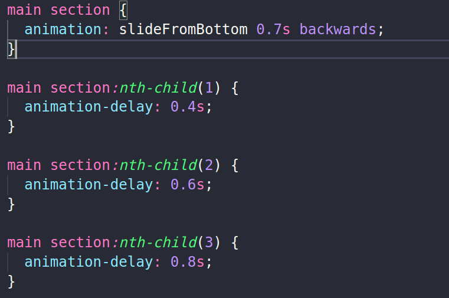
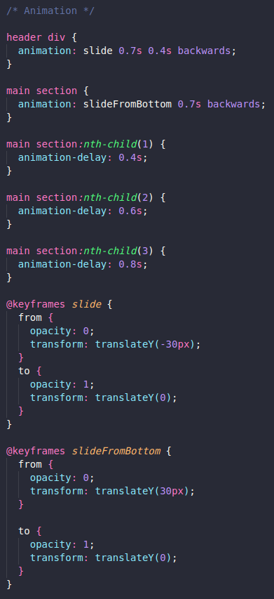

# NLW eSports - Trillha Explorer

Projeto construido no evento Next Level Week da Rocketseat.

[🔗 Clique aqui para acessar](https://mateusalmeida31415.github.io/nlw-esports-explorer/)

## 🛠 Tecnologias

- HTML
- CSS
- Git e Github

## Observações sobre o aprendizado

- Aprendi sobre a propriedade gap para definir espaço entre os elementos de um container que estão sobre a propriedade de display flex ou grid;
- Achei essa a maneira de reduzir a quantidade de código interessante. 
- Achei interessante a repetição dos seletores para aplicar somente a animação. 
